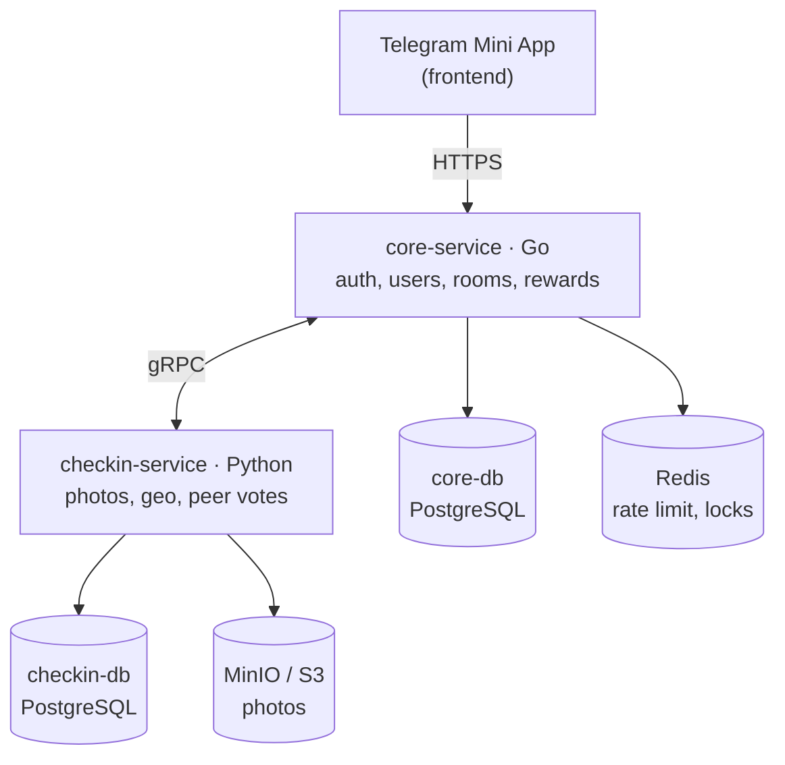

# BuddyGym

Telegram Mini App: gather in rooms and keep each other accountable for gym visits. A workout is confirmed by a photo and peer votes from room members (or by a geo tag as the fast path). Regularity earns achievements, statuses and profile themes.

## Architecture



- **core-service** (Go) is the API gateway for the frontend: Telegram auth, users, rooms, membership, rewards. It also implements `CoreInternalService` (gRPC) for callbacks from checkin.
- **checkin-service** (Python) owns the checkin lifecycle: photos, geo, peer votes, timeouts. It implements `CheckinService` (gRPC) and calls core when a checkin reaches a final status.
- Service contracts live in [proto/buddygym/v1](proto/buddygym/v1) and are generated for both languages (`make proto`, `make proto-py`).
- One Postgres container, two databases: `core_db` and `checkin_db`.

## Quick start

```bash
cp .env.example .env   # set BOT_TOKEN and JWT_SECRET
make up                # postgres + redis + minio + core
curl localhost:8080/api/v1/health
```

Swagger UI: `http://localhost:8080/api/v1/docs`

Auth: `POST /api/v1/auth/telegram` exchanges Telegram `initData` for a JWT; all other endpoints expect `Authorization: Bearer <token>`. Redis backs rate limiting (10/min per IP on token exchange, 120/min per user on the API).

## Development (core-service)

```bash
docker compose up -d postgres redis
cd core-service
go test ./...
go run ./cmd/core
```

Codegen: `make proto` (Go stubs, committed), `make swagger` (OpenAPI spec, freshness is checked in CI).
