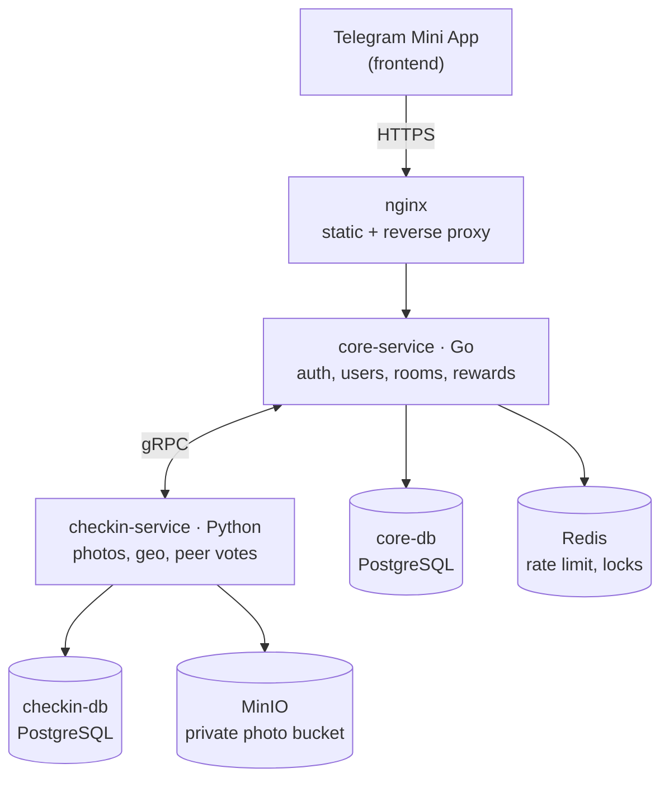

# BuddyGym

Telegram Mini App: gather in rooms and keep each other accountable for gym visits. A workout is confirmed by a photo and peer votes from room members (or by a geo tag as the fast path). Regularity earns achievements, statuses and profile themes.

## Architecture



- **core-service** (Go) is the API gateway for the frontend: Telegram auth, users, rooms, membership, rewards. It also implements `CoreInternalService` (gRPC) for callbacks from checkin.
- **checkin-service** (Python) owns the checkin lifecycle: photos, geo, peer votes, timeouts, photo retention. It implements `CheckinService` (gRPC) and calls core when a checkin reaches a final status.
- Service contracts live in [proto/buddygym/v1](proto/buddygym/v1) and are generated for both languages (`make proto`, `make proto-py`).
- One Postgres container, two databases: `core_db` and `checkin_db`.

## Workspace layout

The other two repositories are cloned into this one (both are gitignored). Compose and proto
generation rely on these paths.

```text
BuddyGym/
├── core-service/     Go (this repository)
├── checkin-service/  Python (separate repository)
├── frontend/         Telegram Mini App (separate repository)
├── proto/            shared gRPC contracts
└── docker-compose.yml
```

## Check-ins and photos

One proof can be submitted to several rooms at once. The photo is uploaded **once** and every resulting checkin references the same object, so posting to five rooms does not store five copies. Each room votes on its own checkin, because the quorum is a per-room setting.

Photos are private end to end:

- the MinIO bucket allows no anonymous access, and no photo URL is ever handed out;
- `GET /api/v1/checkins/{id}/photo` streams the bytes only to members of the room the checkin belongs to;
- uploads are validated by magic bytes, so an SVG or HTML payload cannot be stored under an image name;
- the frontend re-encodes photos before upload, which also strips EXIF (camera GPS tags never leave the device);
- photos are purged 14 days after the checkin, by a background job. A shared photo survives until the newest checkin using it has aged out.

## Quick start

```bash
cp .env.example .env   # set BOT_TOKEN, JWT_SECRET and GEOAPIFY_API_KEY
docker compose up -d --build
curl localhost:8080/api/v1/health
```

Swagger UI: `http://localhost:8080/api/v1/docs`

Auth: `POST /api/v1/auth/telegram` exchanges Telegram `initData` for a JWT; all other endpoints expect `Authorization: Bearer <token>`. Redis backs rate limiting: 10/min per IP on token exchange, 120/min per user on the API, 20/hour per user on checkin creation.

## Development (core-service)

```bash
docker compose up -d postgres redis
cd core-service
go test ./...
go run ./cmd/core
```

Codegen: `make proto` (Go stubs, committed), `make swagger` (OpenAPI spec, freshness is checked in CI).

## Notification bot

[bot-service](bot-service/README.md) reads the `events` outbox in `core_db` and delivers branded
cards in Telegram: comments, vote requests, verdicts, achievements and end-of-period reminders.
It ships in `dry-run` mode, which renders every card to disk and sends nothing; flip `BOT_MODE`
to `live` with a `BOT_NOTIFY_TOKEN` once the cards look right.

## Deploy

[docker-compose.yml](docker-compose.yml) runs the whole stack for local work and exposes every service on the host for convenience.

For a real host, layer [docker-compose.prod.yml](docker-compose.prod.yml) on top. It publishes **one** port, `127.0.0.1:18080`, serving the built frontend plus the API behind nginx. Postgres, Redis, MinIO, core and checkin get no host ports at all.

```bash
cp deploy/.env.prod.example .env   # set BOT_TOKEN, JWT_SECRET, and every password
docker compose -f docker-compose.yml -f docker-compose.prod.yml up -d --build
curl -s -o /dev/null -w '%{http_code}\n' localhost:18080/api/v1/health
```

Terminate TLS in front of it and reverse-proxy the domain to `127.0.0.1:18080`. On a Synology NAS, DSM already owns 80/443, so its built-in reverse proxy (Control Panel, Login Portal, Advanced) forwards `buddygym.ru` to that port while DSM manages the Let's Encrypt certificate. Nothing else on the box is touched.

Update: `git pull && docker compose -f docker-compose.yml -f docker-compose.prod.yml up -d --build`.
