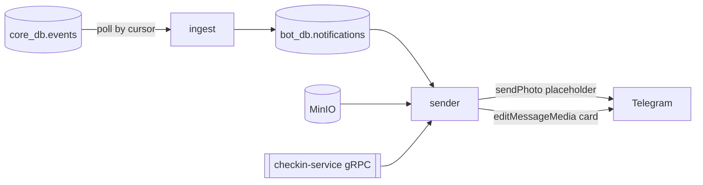

# bot-service

Telegram notification bot for BuddyGym. It reads the `events` outbox in `core_db`, renders a
branded card per notification with Pillow, and delivers it as a photo message.

## How it works



- **Idempotent**: one row per event and recipient, guarded by a unique key, so a restart never
  redelivers.
- **Backfill safe**: anything older than `DIGEST_AFTER_HOURS` is folded into one digest card per
  chat instead of a burst of stale messages.
- **Reachability**: Telegram refuses a DM until the user starts the bot or grants write access
  from the Mini App. A refused chat is marked unreachable and flushed on the next `/start`.
- **Rate limits**: 25 messages a second globally, one per second per chat.

## Notification kinds

| Kind | Sent to | Trigger |
| --- | --- | --- |
| `comment` | photo author | someone comments on their checkin |
| `vote_request` | other members | a checkin needs votes |
| `approved` / `rejected` | checkin author | the vote finished |
| `achievement` | checkin author | an achievement was granted |
| `buddy_credited` | tagged buddy | a joint workout was credited |
| `member_joined` | other members | someone joined the room |
| `freeze_scheduled` | other members | someone scheduled a freeze |
| `reminder` | member behind the goal | the period closes within `REMINDER_HOURS_BEFORE` |
| `digest` | any chat | stale events folded on first run |

## Modes

`BOT_MODE=dry-run` (default) renders every card to `BOT_DRY_RUN_DIR` with its payload and sends
nothing. `BOT_MODE=live` needs `BOT_TOKEN` and talks to Telegram.

## Development

```bash
uv sync
make lint
make test              # unit
make test-integration  # needs docker
make dry-run
```

Migrations: `make migrate` (alembic, `bot_db`).
